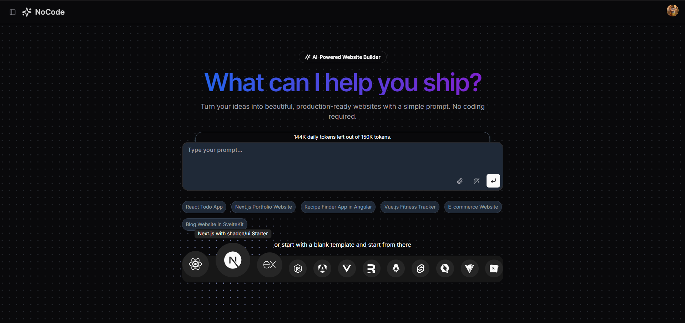

# No-Code

A modern web application that allows users to build websites and applications using natural language prompts. The project uses AI to generate code from user descriptions and provides a live development environment.



## 🚀 Features

- **AI-Powered Code Generation**: Convert natural language descriptions into functional code
- **Live Development Environment**: Built-in web container for real-time code execution
- **Multiple Template Support**: Various starter templates including:
  - React + Vite + TypeScript
  - Next.js with shadcn/ui
  - Vue.js
  - Remix TypeScript
  - Astro Basic
  - SvelteKit
  - Qwik TypeScript
  - Vanilla + Vite
- **Real-time Preview**: Instant preview of your application changes
- **Authentication**: Secure user authentication via Clerk
- **Project Management**: Save and manage multiple projects
- **File System Management**: Create and edit files directly in the browser

## 🛠 Tech Stack

### Frontend (client)

- React 18+ with TypeScript
- Vite for build tooling
- Tailwind CSS for styling
- shadcn/ui components
- Web Container API for browser-based development

### Backend (server)

- Node.js
- Express.js
- Prisma ORM

### Database

- PostgreSQL (via Prisma)

## 📁 Project Structure

```bash
├── client/               # Frontend application
├── server/              # Backend API server
├── packages/            # Shared packages
│   ├── common/         # Shared types and utilities
│   ├── db/            # Database configuration and Prisma client
│   └── prisma/        # Prisma schema and migrations
```

## 🚀 Getting Started

1. **Clone the repository**

```bash
git clone https://github.com/Sasidhar-Sunkesula/no-code
```

2. **Install dependencies**

```bash
npm install
```

3. **Set up environment variables**
   Create `.env` files in both client and server directories with necessary configurations:

Required environment variables: Check `.env.example` files for reference.

4. **Start development servers**

```bash
# Start all services
npm run dev

# Start specific services
npm run dev:client  # Frontend only
npm run dev:server  # Backend only
```

5. **Build for production**

```bash
npm run build
```

## 🔄 Development Workflow

1. Projects start with a natural language description
2. AI selects appropriate templates and generates initial code
3. Files are created in the web container environment
4. Live preview updates as changes are made
5. Projects can be saved and resumed later

## Deployment and Hosting Process

1. Install Nginx on your server:

```bash
sudo apt update
sudo apt install nginx
```

2. Copy the configuration file to Nginx sites-available:

```bash
sudo cp nginx.conf /etc/nginx/sites-available/no-code
```

3. Edit the configuration file to replace placeholders:

````bash
sudo nano /etc/nginx/sites-available/no-code

Replace:

- your-frontend-domain.com with your actual frontend domain
- your-api-domain.com with your actual API domain
- Update SSL certificate paths if needed

4. Create a symbolic link to enable the site:
```bash
sudo ln -s /etc/nginx/sites-available/no-code /etc/nginx/sites-enabled/
````

5. Test Nginx configuration:

```bash
sudo nginx -t
```

6. If the test passes Reload Nginx to apply changes:

```bash
sudo systemctl reload nginx
```

7. Configure SSL: This configuration assumes you have SSL certificates from Let's Encrypt. If you don't have them yet, you can obtain them using Certbot:

```bash
sudo apt install certbot python3-certbot-nginx
sudo certbot --nginx -d your-frontend-domain.com -d your-api-domain.com
```

8. Set up automatic SSL certificate renewal:

```bash
sudo certbot renew --dry-run
```

## Common Issues

### CORS Errors

If you're experiencing CORS errors, make sure:

- The Access-Control-Allow-Origin header in the API server block matches your frontend domain exactly
- Your backend isn't also setting CORS headers (which would cause duplicates)

### WebContainer Issues

For WebContainers to work properly, the frontend server must have these headers:

- Cross-Origin-Embedder-Policy: require-corp
- Cross-Origin-Opener-Policy: same-origin
  If WebContainers aren't working, check that these headers are being sent correctly.

## 📦 Available Scripts (for development)

- `npm run dev`: Start development environment
- `npm run build`: Build all packages for production
- `npm run start`: Start production servers
- `npm run clean`: Clean all build artifacts and node_modules

## 🔐 Authentication

The application uses Clerk for authentication and user management. Users need to sign up/login to:

- Create new projects
- Save projects

## 🗄️ Database Schema

Key entities:

- Projects
- Files
- Messages
- Users

## 🤝 Contributing

1. Fork the repository
2. Create a feature branch
3. Commit your changes
4. Push to the branch
5. Open a Pull Request
